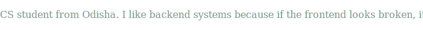

# Hi there 👋 I'm Senko

Welcome to my GitHub profile! I'm passionate about building web applications and creating efficient solutions.

## 🚀 About Me
- 🎓 Learning and growing as a developer
- 💻 Interested in web development and creative projects
- 🎯 Currently working on portfolio projects

## 🛠️ Projects
- **ZENITH Note-Taking App** - A minimalist and efficient web application for capturing thoughts and organizing tasks
- **My Portfolio** - Showcasing my work and skills

## 💡 Skills & Technologies
- HTML, CSS, JavaScript
- Web Development
- Problem Solving

## 📫 Get in Touch
- GitHub: [@senko77-let](https://github.com/senko77-let)
- Check out my repositories to see what I'm working on!

---

*"Code is poetry written for humans to read, and machines to execute."*
